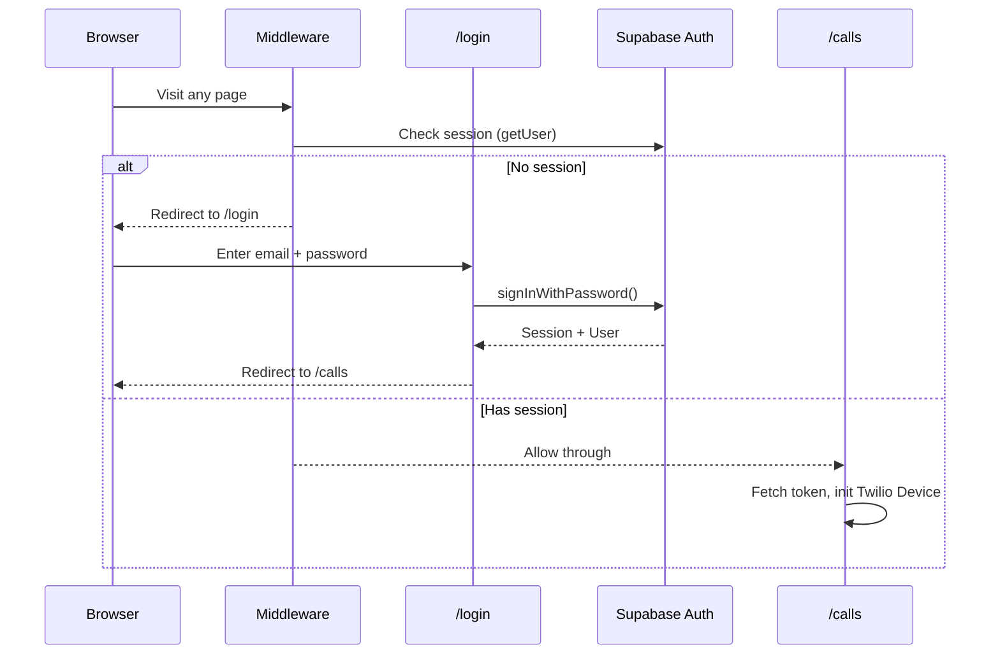
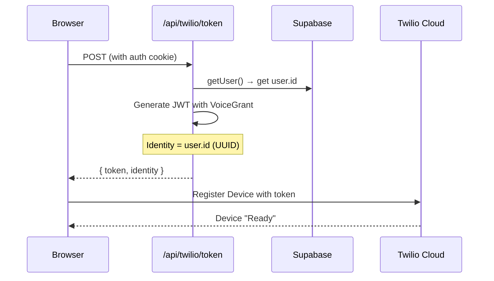
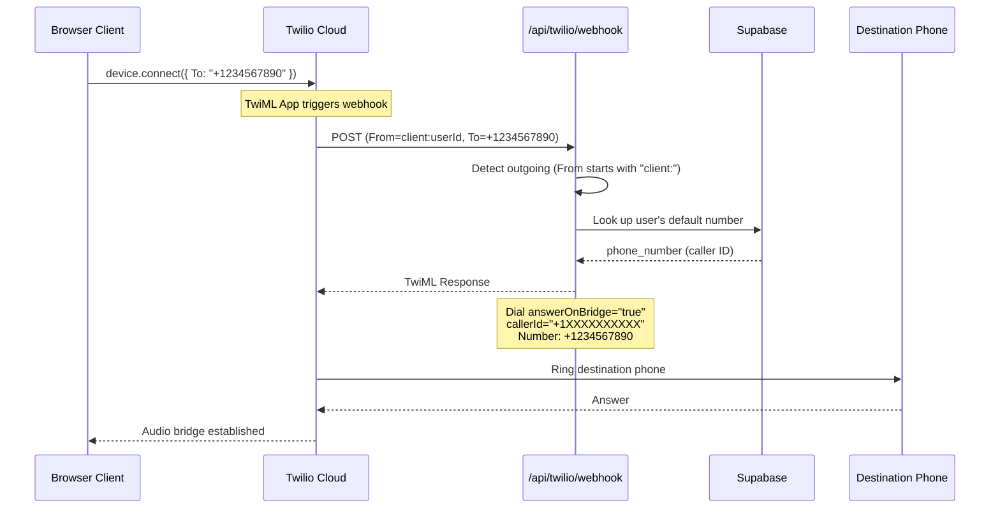
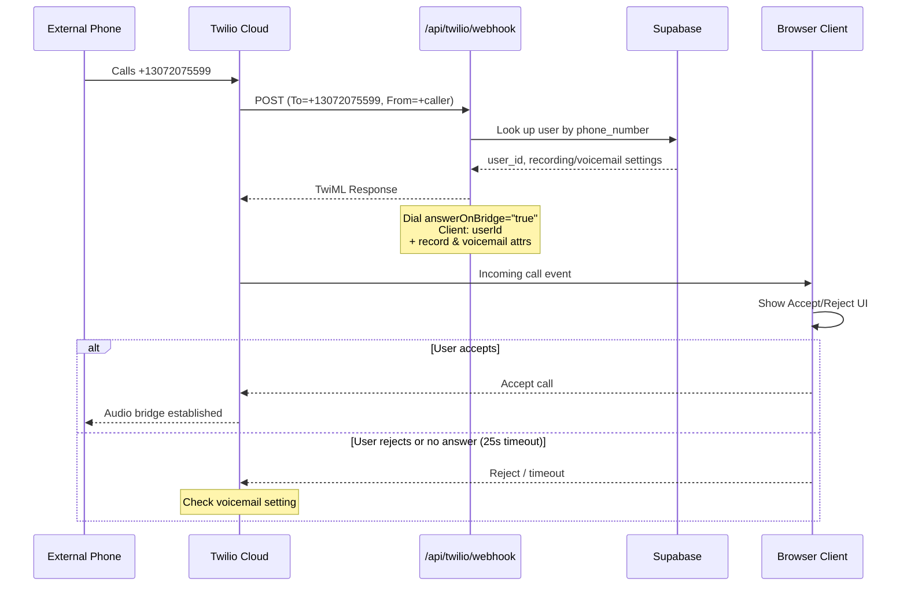
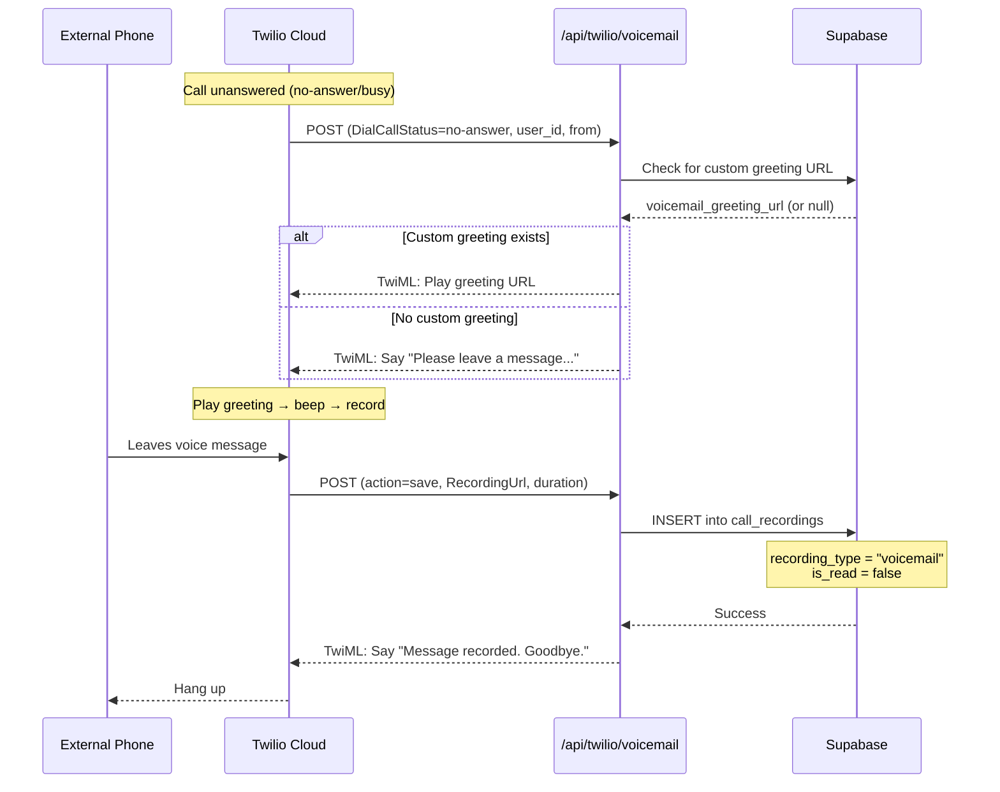
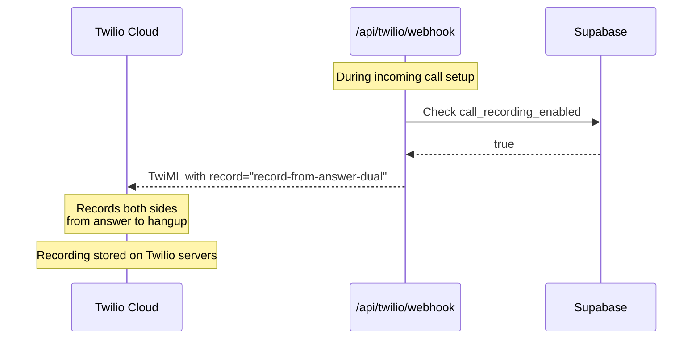
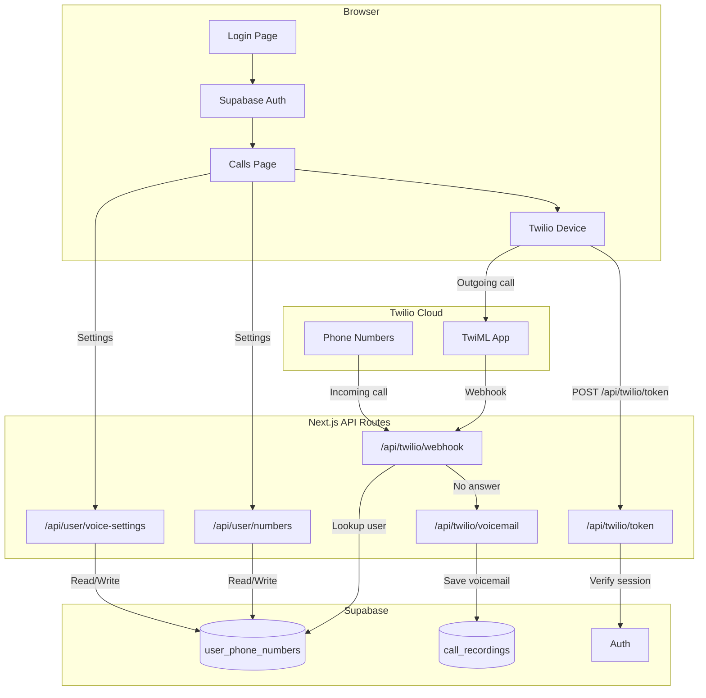

# Netro Scale - Call Flow Diagrams

## Login & Authentication

---

## Twilio Device Initialization

---

## Outgoing Call

---

## Incoming Call

---

## Voicemail Flow

---

## Call Recording

---

## Complete System Overview

